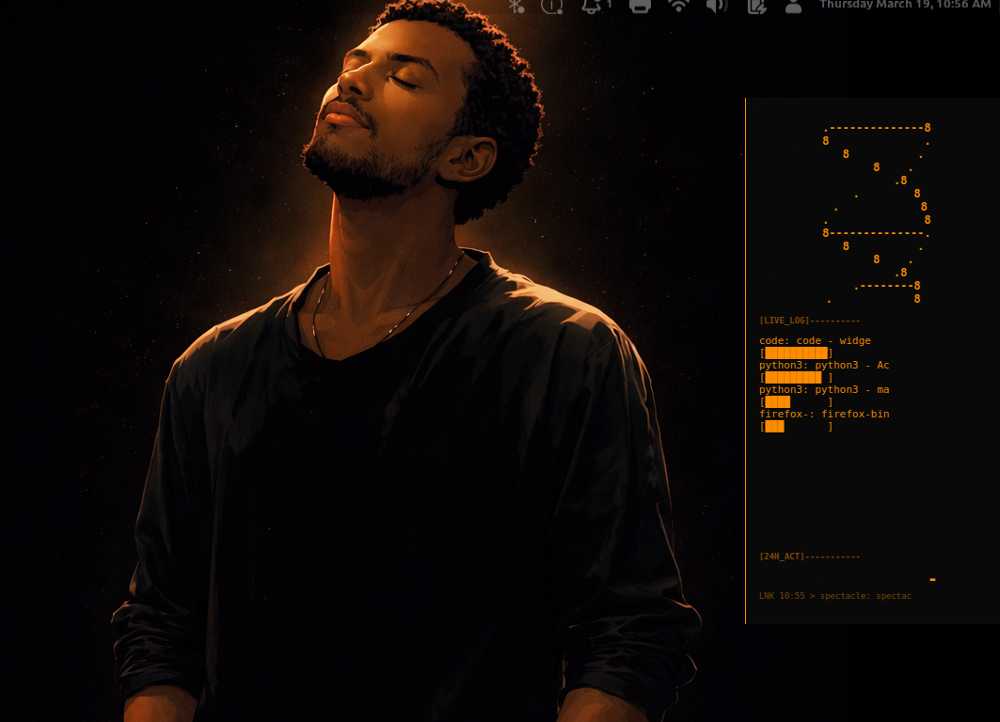
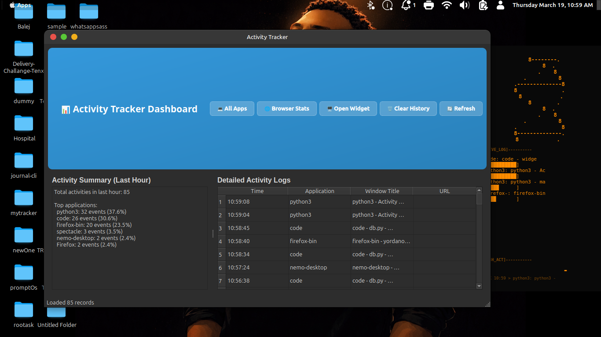
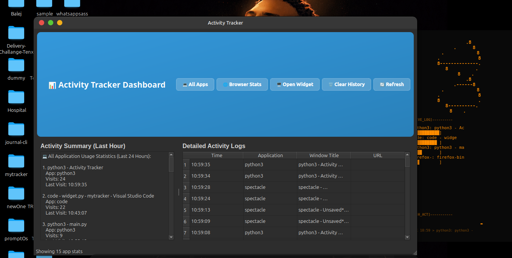

# Activity Tracker

A comprehensive desktop activity tracker that monitors window usage and browser tabs, providing detailed insights into your computer usage patterns.

## Features

- **Desktop Window Tracking**: Automatically tracks active windows and applications across Windows, macOS, and Linux
- **Browser Tab Monitoring**: Chrome and Firefox extensions track tab usage and URLs
- **Real-time Dashboard**: PyQt6-based GUI showing activity summaries and detailed logs
- **Floating Widget**: Minimal overlay widget for quick activity overview
- **Cross-platform**: Works on Windows, macOS, and Linux
- **SQLite Database**: Local storage for all activity data

## Screenshots

**Dashboard Overview**



**Widget Overlay**



**Browser Stats**



## Installation

1. **Clone the repository:**
   ```bash
   git clone <repository-url>
   cd mytracker
   ```

2. **Create and activate virtual environment:**
   ```bash
   python3 -m venv venv
   source venv/bin/activate  # On Windows: venv\Scripts\activate
   ```

3. **Install dependencies:**
   ```bash
   pip install -r requirements.txt
   ```

4. **Install platform-specific tools:**
   - **Linux**: Install `xdotool` for window tracking
     ```bash
     sudo apt install xdotool  # Ubuntu/Debian
     sudo yum install xdotool  # CentOS/RHEL
     ```
   - **Windows**: No additional tools needed
   - **macOS**: No additional tools needed

## Usage

### Starting the Tracker

```bash
# Start in background mode (tracking only)
python main.py

# Start with main GUI window
python main.py --gui

# Start with floating widget
python main.py --widget

# Start both GUI and widget for testing
python main.py --test
```

### Browser Extensions

#### Chrome Extension
1. Open Chrome and go to `chrome://extensions/`
2. Enable "Developer mode"
3. Click "Load unpacked" and select the `browser_extension/chrome/` folder
4. The extension will start sending tab data to the tracker

#### Firefox Extension
1. Open Firefox and go to `about:debugging#/runtime/this-firefox`
2. Click "Load Temporary Add-on"
3. Select the `browser_extension/firefox/manifest.json` file
4. The extension will start sending tab data to the tracker

**Note:** For permanent installation:
1. Open Firefox and go to `about:addons`
2. Click the gear icon and select "Install Add-on From File"
3. Navigate to the `browser_extension/firefox/` directory
4. Select the `manifest.json` file
5. The extension will be installed and ready to use

**If manifest.json doesn't appear selectable:**
1. Make sure you're selecting the `manifest.json` file (not the folder)
2. Try renaming the file temporarily to something like `tracker-manifest.json`
3. Or create a ZIP file containing both `manifest.json` and `background.js` files
4. Install the ZIP file through the Firefox add-ons manager

## Project Structure

```
mytracker/
├── main.py                 # Main application entry point
├── requirements.txt        # Python dependencies
├── activity.db            # SQLite database (created automatically)
├── tracker/
│   ├── db.py             # Database operations
│   ├── window_tracker.py # Desktop window tracking
│   └── browser_tracker.py # Browser communication server
├── gui/
│   ├── main_window.py    # Main dashboard GUI
│   └── widget.py         # Floating widget
├── utils/
│   └── helpers.py        # Utility functions
└── browser_extension/
    ├── chrome/           # Chrome extension files
    └── firefox/          # Firefox extension files
```

## Features Overview

### Desktop Window Tracking
- Automatically detects active windows every 5 seconds
- Records application name, window title, and timestamp
- Cross-platform support (Windows, macOS, Linux)

### Browser Tab Tracking
- Chrome and Firefox extensions send tab data via HTTP
- Records tab title, URL, and application name
- Real-time updates when switching tabs

### GUI Dashboard
- **Activity Summary**: Shows top applications used in the last hour
- **Detailed Logs**: Table view of all tracked activities
- **Auto-refresh**: Updates every 10 seconds
- **Search and Filter**: Sortable table with full activity history

### Floating Widget
- Minimal overlay showing top 3 applications
- Always on top, frameless window
- Updates every 10 seconds

## Database Schema

The tracker uses SQLite with the following schema:

```sql
CREATE TABLE logs (
    timestamp REAL,
    app TEXT,
    window_title TEXT,
    url TEXT
);
```

## Troubleshooting

### Common Issues

1. **Browser extension not sending data:**
   - Ensure the tracker is running and the server is active on port 5001
   - Check browser console for extension errors
   - Verify firewall settings allow localhost connections

2. **Window tracking not working on Linux:**
   - Install `xdotool`: `sudo apt install xdotool`
   - Ensure X11 is running and accessible

3. **GUI not appearing:**
   - Check if PyQt6 is properly installed
   - Verify display settings and permissions

### Debug Mode

Use the `--test` flag to run both GUI and widget for testing:

```bash
python main.py --test
```

### Manual Testing

Test the browser extension manually:

```bash
curl -X POST http://localhost:5001/tab_update \
  -H "Content-Type: application/json" \
  -d '{"app": "Chrome", "title": "Test Page", "url": "http://example.com"}'
```

## Development

### Adding New Features

1. **New tracking capabilities**: Modify `tracker/window_tracker.py`
2. **New GUI components**: Add to `gui/main_window.py`
3. **New browser support**: Create extension in `browser_extension/`

### Testing

Run the application in test mode to verify all components:

```bash
python main.py --test
```

## License

This project is licensed under the MIT License.

## Contributing

1. Fork the repository
2. Create a feature branch
3. Make your changes
4. Add tests if applicable
5. Submit a pull request
